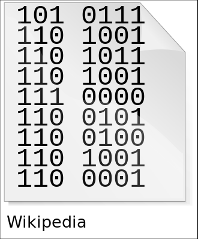
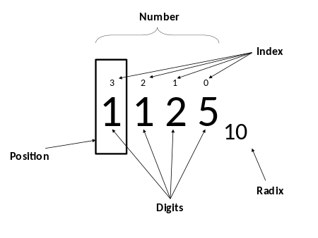
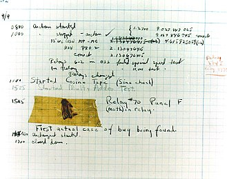

 <front color="red" > **PART 1 OF 2**</front>
 color=#0099ff size=72 face="黑體"
* 1分12秒 = （ **7200** ）毫秒
* （7A）13 = （ **101** ）10 
* （7A）16 = （ **122** ）10 
* （7A）16 = （ **1111010** ）2 = （ **172** ）8 
* （1011011）2 = （ **133** ）8 = （ **5B**）16 
* （678）10 = （ **1010100110** ）2 = （ **1246** ）8 
* （111）2 + （101）2 = （ **1100** ）2

# PART 2 OF 2

## **Information 资讯**
>Information is any entity or form that provides the answer to a question of some kind or resolves uncertainty. It is thus related to data and knowledge, as data represents values attributed to parameters, and knowledge signifies understanding of real things or abstract concepts.

 

## **Positional notation  進位制**
>Positional notation or place-value notation is a method of representing or encoding numbers. Positional notation is distinguished from other notations (such as Roman numerals) for its use of the same symbol for the different orders of magnitude (for example, the "ones place", "tens place", "hundreds place").

 

## **Algorithm 演算法**
>In mathematics and computer science, an algorithm is an unambiguous specification of how to solve a class of problems. Algorithms can perform calculation, data processing and automated reasoning tasks.

 

## **Software bug 程式错误**
>A software bug is an error, flaw, failure or fault in a computer program or system that causes it to produce an incorrect or unexpected result, or to behave in unintended ways. The process of fixing bugs is termed "debugging" and often uses formal techniques or tools to pinpoint bugs, and since the 1950s, some computer systems have been designed to also deter, detect or auto-correct various computer bugs during operations.

##### 
 A page from the Harvard Mark II electromechanical computer's log, featuring a dead moth that was removed from the device.

---------

### 十进制————**decimal** 
### 二进制————**binary**
### 八进制————**octonary**
### 十六进制———**hexadecimal**