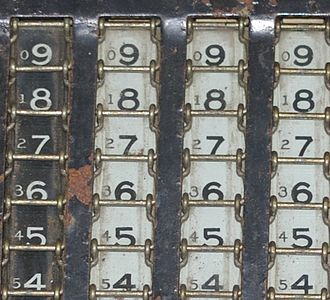

## PART 1 OF 2
 
溢出错误：2,4\
精度误差：7

## PART 2 OF 2

## **Method of complements 补语法**
>In mathematics and computing, the method of complements is a technique used to subtract one number from another using only addition of positive numbers. This method was commonly used in mechanical calculators and is still used in modern computers.\
在数学和计算中，补方法是一种只用正数的加法来从一个数减去另一个数的技术。这种方法在机械计算器中是常用的，至今仍在现代计算机中使用。

 

## **Byte 字节**
>The byte is a unit of digital information that most commonly consists of eight bits, representing a binary number. Historically, the byte was the number of bits used to encode a single character of text in a computer and for this reason it is the smallest addressable unit of memory in many computer architectures.
位元組（中國大陸作字節，港澳作位元組，英語：Byte），通常用作電腦資訊計量單位，不分資料型態。一個位元組代表八個位元（中國大陸作比特，港澳作位元，英語：Bit）。從歷史的觀點上，「位元組」表示用於編碼單個字元所需要的位元數量。歷史上位元組長度曾基於硬體為1-48位元不等，最初通常使用6位元或9位元為一位元組。今日事實標準以8位元作為一位元組，因8為二進位整數。

 

## **Integer (computer science) 整数（计算机科学）**
>In computer science, an integer is a datum of integral data type, a data type that represents some range of mathematical integers. Integral data types may be of different sizes and may or may not be allowed to contain negative values. Integers are commonly represented in a computer as a group of binary digits (bits). The size of the grouping varies so the set of integer sizes available varies between different types of computers. Computer hardware, including virtual machines, nearly always provide a way to represent a processor register or memory address as an integer.\
在计算机科学中，整数是整数数据类型的数据，是表示某种数学整数范围的数据类型。积分数据类型可以是不同的大小，并且可以允许或不允许包含负值。整数在计算机中通常表示为一组二进制数字（位）。分组的大小不同，因此可用的整数大小集合在不同类型的计算机之间有所不同。计算机硬件，包括虚拟机，几乎总是提供一种将处理器寄存器或内存地址表示为整数的方法。

 

## **Floating point 浮点数**
>In computing, floating-point arithmetic (FP) is arithmetic using formulaic representation of real numbers as an approximation so as to support a trade-off between range and precision. For this reason, floating-point computation is often found in systems which include very small and very large real numbers, which require fast processing times.\
在计算中，浮点算法（FP）是使用实数的公式表示作为近似，以支持范围和精度之间的权衡的算法。由于这个原因，浮点计算经常出现在包含非常小和非常大的实数的系统中，这需要快速的处理时间。

---------

1)

-------

2) x=-15，占8位。二进制是(**11110001**)，八进制是(**361**)。 

------
3) 1
* x转十进制是(**-31**),在内存中占了1 byte， 
* 二进制是(**1110 0001**) 
* 十六进制为(**0xe1**). 而y占4 bytes, 在进行赋值计算时x会自动变为4 bytes，并用符号位的数字补位，即为(**1111 1111 1111 1111 1111 1111 1110 0001**) 
* 十进制是<b>-31</b> 
* ##### 十六进制是(**0xffffffe1**)

------
3) 2
基为b，x表示为b进制a0a1a2a3，以4位为例x = ((a0 * b + a1) * b + a2) * b + a3a3 = x % bx / b = ((a0 * b + a1) * b + a2)这样继续做下去就可以了。到a0那儿可以看成是(0 * b + a0) * b，也就是商为0时终止。

------

4) 
## NAH 非数
In computing, NaN, standing for not a number, is a numeric data type value representing an undefined or unrepresentable value, especially in floating-point calculations. Systematic use of NaNs was introduced by the IEEE 754 floating-point standard in 1985, along with the representation of other non-finite quantities like infinities.