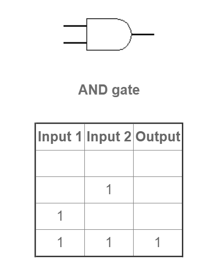
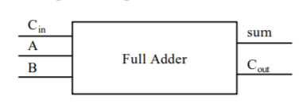

# PART1 拓展问题

 **1) Give the three representations of an AND gate and say in your words what *AND* means.**
 
 答： 

 

皆真为真

**2) Give the three representations of an *XOR* gate and say in yours.**
 答： 

 
一真便真

**3) Draw a circuit jie corresponding to the following Boolean
expression: (A + B)(B + C)**
 答： 

 

**4) Show the behavior of the following circuit with a truth table:**
 答： 

 

|   A | B| A' | A\*B | A'+A*B |
|:---:|:-----:|:---------:|:---------:|:---------:|
|0|0|1|0|1
|0|1|1|0|1
|1|0|0|0|0
|1|1|0|1|1
     

**5) What is circuit equivalence? Use truth table to prove the
following formula. **
**
(AB)’ = A’ + B’ 
**
 答： 

|   A | B| A' |B'| A\*B |(A\*B)'| A'+B' |
|:---:|:-----:|:---------:|:---------:|:---------:|:---------:|:---------:|
|0|0|1|1|0|1|1
|0|1|1|0|0|1|1
|1|0|0|1|0|1|1
|1|1|0|0|1|0|0

**6) There are eight 1bit full adder integrated circuits. Combine them to 8bit adder
circuit using the following box diagram.**

 
 答： 

**7) Logical binary operations can be used to modify bit pattern. Such as
(X8X7X6X5X4X3X2X1
)2 and (00001111)2 = (0000X4X3X2X1
)2  
We called that (00001111)2
is a mask which only makes low 4 bits to work.
Fill the follow expression** 
答： 
(1)(X8X7X6X5X4X3X2X1
)2or (00001111)2 = (X8X7X6X51111 )2 

(2) (X8X7X6X5X4X3X2X1
)2
xor (00001111)2 = ( (X8X7X6X5X4'X3'X2'X1')2 

(3) ((X8X7X6X5X4X3X2X1
)2 and (11110000)2 )
or (not (X8X7X6X5X4X3X2X1
)2
and (00001111)2
) = (X8X7X6X5X4X3X2X1 )2

# PART3 名词解释
## 1.Logic gate邏輯閘
In electronics, a logic gate is an idealized or physical device implementing a Boolean function; that is, it performs a logical operation on one or more binary inputs and produces a single binary output. 
邏輯閘是在積體電路上的基本組件。簡單的邏輯閘可由電晶體組成。。這些電晶體的組合可以使代表兩種訊號的高低電平在通過它們之後產生高電平或者低電平的訊號。高、低電平可以分別代表邏輯上的「真」與「假」或二進位當中的1和0，從而實現邏輯運算。

 

## 2.Boolean algebra布尔代数
In abstract algebra, a Boolean algebra or Boolean lattice is a complemented distributive lattice. This type of algebraic structure captures essential properties of both set operations and logic operations. 
在抽象代數中，布林代數（英語：Boolean algebra）是捕獲了集合運算和邏輯運算二者的根本性質的一個代數結構（就是說一組元素和服從定義的公理的在這些元素上運算）。特別是，它處理集合運算[[]運算與、或、非。

## 3.Flip-flop正反器
1.國大陸譯作「觸發器」、臺灣及香港譯作「正反器」，是一種具有兩種穩態的用於儲存的元件，可記錄二進位數位訊號「1」和「0」。

 
2. 1bit