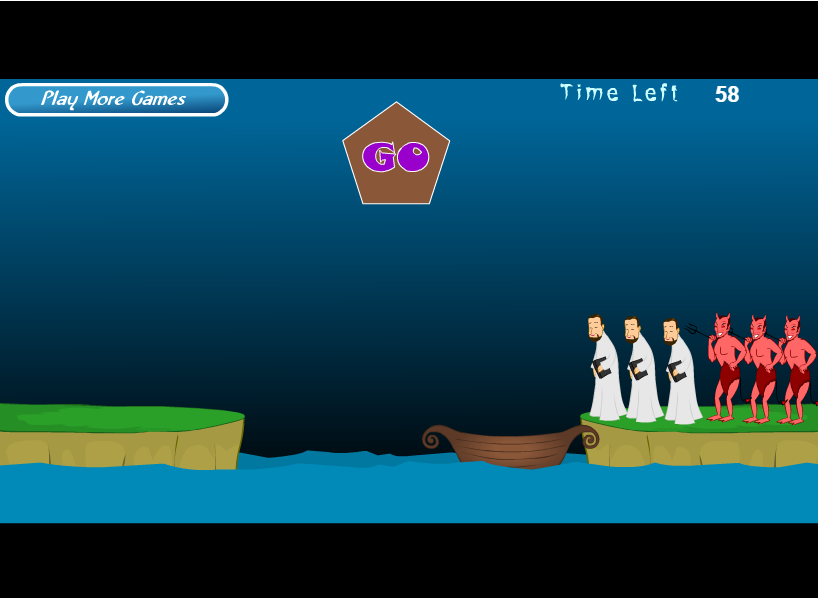

# **“牧师与恶魔过河”**
>首先进入[游戏](http://www.17yy.com/f/69854.html0)的介绍并玩游戏。 

### **1. 游戏涉及哪些类。请列表说明**

>|  类  |     |
>|:---:|:---:|
>|人物|魔鬼跟牧师|
>|背景|船，河，岸|
>|文本|GO键，计时|

### **2. 游戏中有哪些对象，各几个。例如，船（一个）类和对象的区别是什么？举一个例子说明  **
>对象：3个牧师，3个魔鬼，1条船，1条河，2块岸，1个按键，1个计时文本。
类和对象的分别是，类是抽象的大类，然后对象包含在类且是具体的例子。

### **3. 游戏中的魔鬼，有哪些属性和方法？  **
>属性：翻滚上下船，用叉叉杀死牧师。

### **4. 假设魔鬼被鼠标点中，会执行onclick事件，请用文字（伪代码）描述这个事件中魔鬼与其他对象沟通的过程。**
>  Onclick:
 
     If(恶魔在岸上）

        THEN（恶魔翻跟头进入船中）

        ELSE（恶魔从船上翻跟头到达岸上）

        ENDIF

### **5. 类或对象会是动词吗？ **
>应该会。例如运动是类，游泳，跑步，打拳就是对象也可以是动词。