# 数分钟学会 Adobe Premiere Pro
>前言：你喜欢透过视频记录生活吗？你想把你的视频变得更独一无二吗？本篇内容主要是透过前期安装Pr以及后期的简单操作进行解说，希望能让对剪辑视频有兴趣的读者能够对Adobe Premiere Pro有更深入地了解，让你的视频变得更多姿多彩。

**所需软件**
=======
>**关于下载Adobe Premiere Pro，你可以选择到[官网](https://www.adobe.com/cn/)进行下载，虽然官网上下载会比较安全但是试用期只有30天，那么我们可以通过破解的方法让你可以无止境的使用adobe软件。**

1.Adobe Premiere Pro \
2.破解软件 amtemu [私藏百度网盘](https://pan.baidu.com/s/1MQidjUTeFc687BtPJcjXfQ)  密码：eocp

**安装步骤**
=======

1.到官方网站下载所需要的软件，下载完后进行安装。

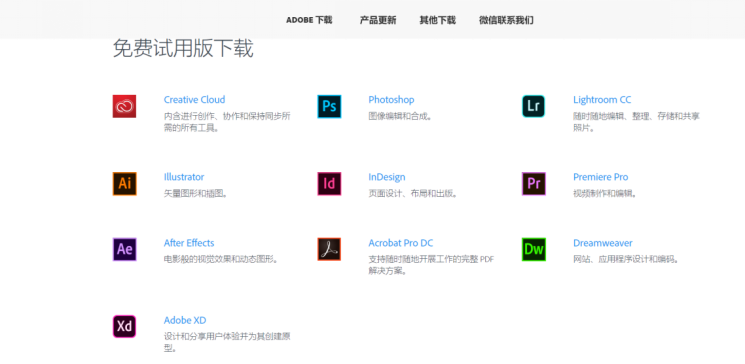

2.进行各种加载运行后会跳到登陆页面 ` （建议在安装的过程把网络断开便可以避免登陆的步骤） ` 

3.安装完软件打开一次之后把软件关闭，打开下载好的破解软件amtemu,点选软件版本，然后点击Advanced.

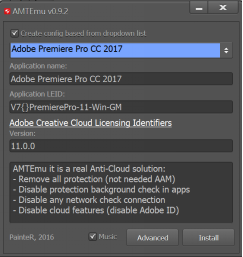 \
4.运行结束打开软件你就会发现没有了试用期的视窗了~ 安装完成 ~
  
**简单操作**
=======
1.运行 Pr 点击新建项目，得到以下画面。

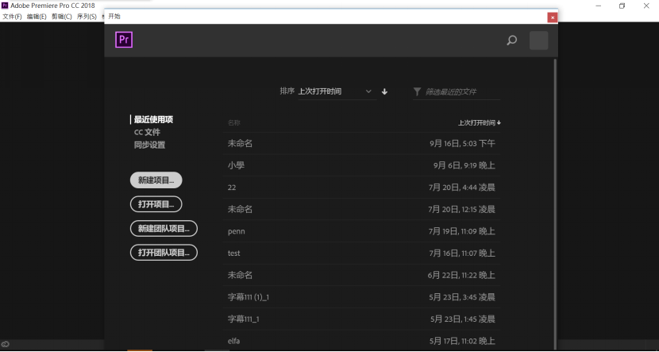\
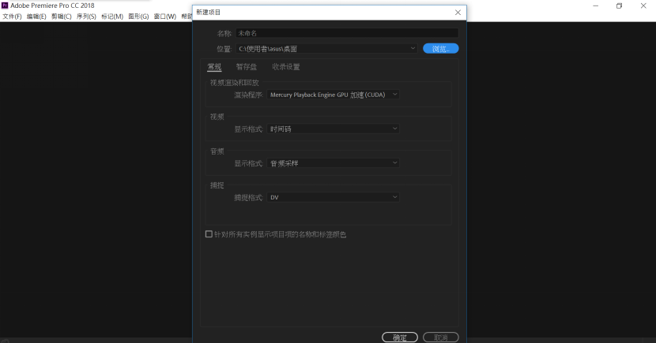\
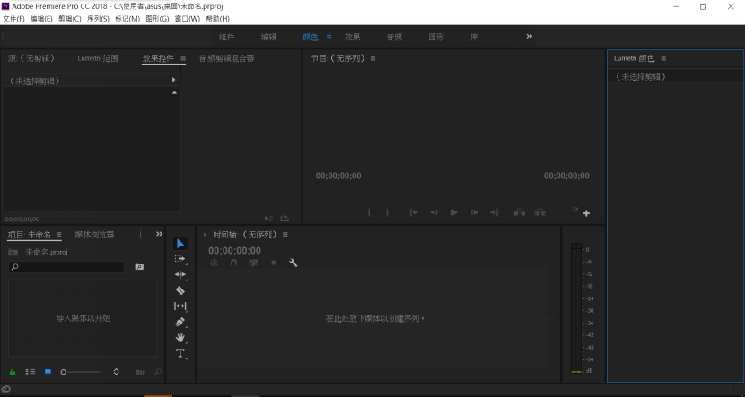

2.导入素材有两种方法，一是双击左下角的【导入媒体以开始】，二是直接把素材拖进时间轴中。

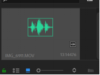

 >假使导进视频后发现媒体只有音讯而没有画面，这时检查一下媒体的格式，例如现在是.MOV把格式转化成.MP4等兼容的格式。

3.正确导入媒体后的画面

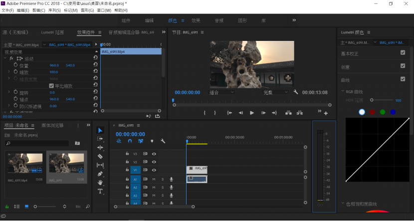

4.使用剃刀工具把不需要的部分裁剪

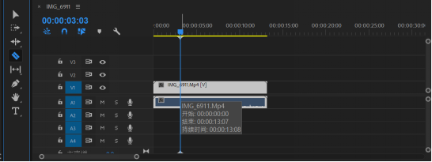

5.左下角A1的M转为绿色表示该音频为静音，把想要的背景音乐拖进时间轴A2中。

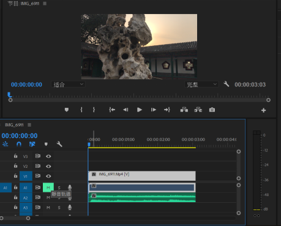

6.导出影片点击【文件】->【导出】->【媒体】

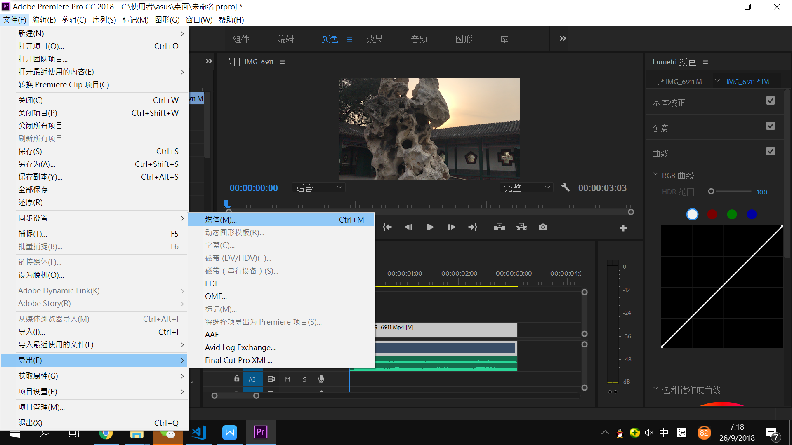

7.红色框框是建议的输出设定。下方的红框拖移越右清晰度越高文件大小越大。

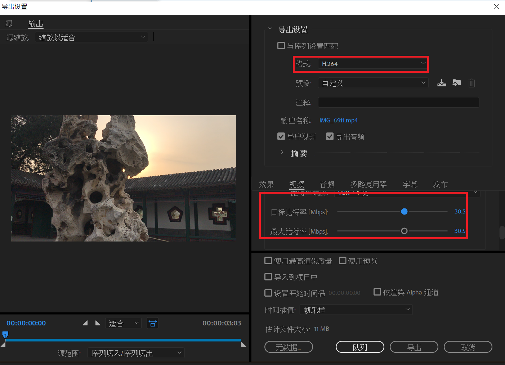

8.一条影片便大功告成了！

 **最后希望本篇可以帮到对操作Pr有兴趣的读者们~**

**谢谢阅览**