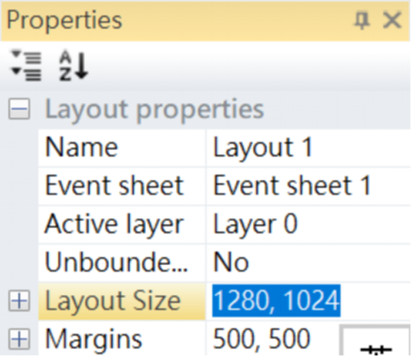
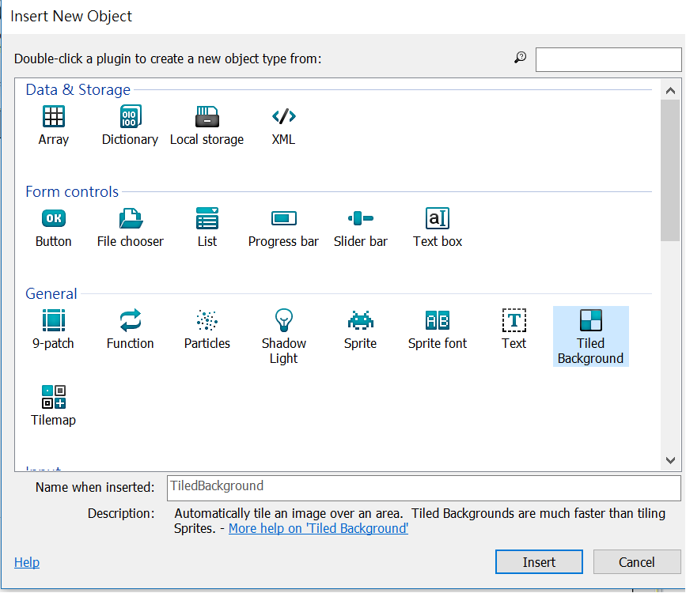
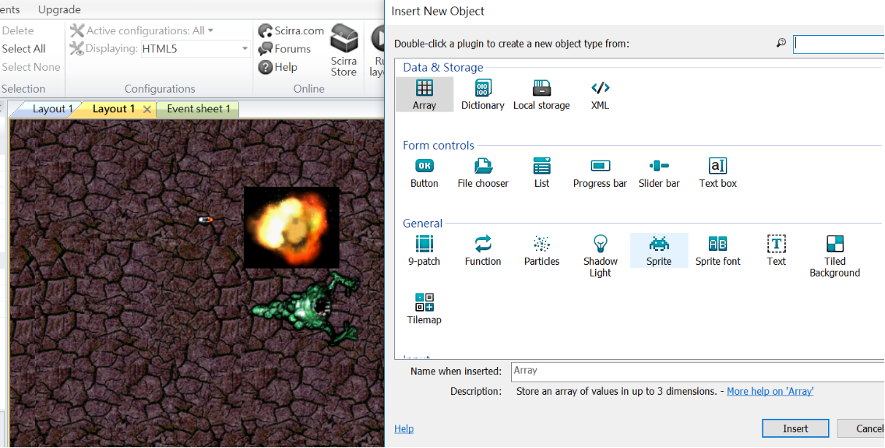

# __利用Construct 2制作HTML射击小游戏__
## 安装Construct 2
-------
进入[官网](https://www.scirra.com/construct2/releases/r262)点击download下载软件并进行安装

## 新建文件
-------
1.点击左上角的File>New>New empty project

## 游戏素材
-------
* 先右键另存以下所需图片素材

## 制作步骤（导入素材）
-------
1.先建立游戏背景，首先在左侧`Properties`处下滑找到`Layout Size`，然后把界面尺寸设置1280,1024。

2.设置完背景尺寸之后，双击空白出弹出一个名为`Insert New Object` 的界面。点击 `Tiled Background`然后insert。之后你会发现鼠标变成了十字形状，在空白处点击一下，便弹出右图界面。

3.点击左上角第二个图标汇入下载好的图片。关闭窗口之后图片便会在界面上。点击图片在左侧属性栏中找到`Common`调节Position：0,0 Size：1280，1024。为了不让在制作过程中移动到背景，可以点击右侧`Layers`第三个锁🔒的图标以锁定图层。
>* control+鼠标滑轮可以调节窗口大小  
>* 紧按空白键可以拖移视窗

4.接着以同样的方式加入人物(player)，子弹(bullet)，怪兽(monster)爆炸特效(explode)，滑鼠（Mouse）以及键盘（Keyboard）。在导入素材之前先在Layers新建一个图层来放入4个素材。而在`Insert New Object` 的界面中选取`Sprite`在下放的框格可以先改名字，然后导入步骤跟步骤2是相同的。
>新增多只怪兽可以按着`ctrl`键，然后拖拉怪兽素材

## 制作步骤（事件插入）
-------
1.双击players，打开视窗后点击左下角的瞄准标志，然后会跳出一个`Image point`的视窗，新建一个点然后在player素材的中间点一下。（这个操作的目的是定义了bullet发出位置以及调整目标角度）

2.加入素材事件动作，首先点击一下素材，然后在左侧属性中找到`Behaviors`，点击。分别按照以下新增相应的行为。
* **Player**: 8 Direction（使用方向键移动player）,ScrollTO（界面随人移动）,BoundToLayout（使任务不会移到窗口外）
* **Blullet**：Bullet,DestroyOutsideLayout
* **Monster**：Bullet（在可以在属性栏中调节speed至80或者你喜欢的速度）
* **Explode**：Fade（可以在属性栏中调节淡出时间提高流畅度，可改成0.5。将speed调至400。然后再`effect`中把blend mode改为`additive`）

3.点击画面上的`Event sheet`进行事件设置。在界面上方点击`View`然后点击`Add event`。
>先点击其中一只怪兽（改变一只怪兽的属性其他也会跟这更改）在属性栏找到I`Instance variables`新增一个名为health的变量然后输入一个你喜欢的数字.(这个步骤是为了设置当任务碰到了怪兽多少次后死亡的设置)

4.按照一下图片新增事件

5.点击右上角`runout layout`便可测试游戏

6.简单的游戏制作完成~[试玩通道](http://localhost:50000/)

## 游戏截频
-------

 谢谢阅读  
by yodaboy
