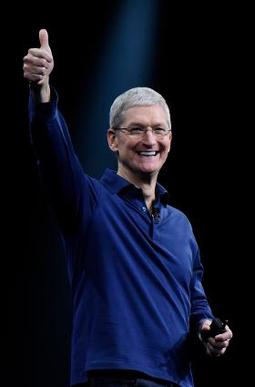
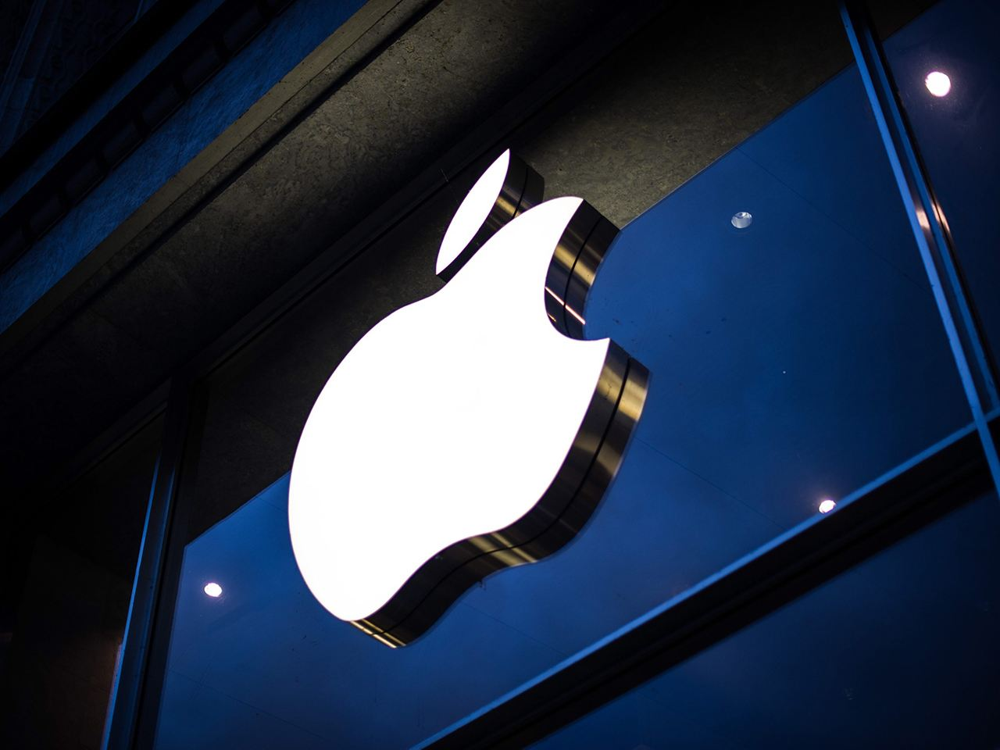

# **Tim Cook——被世人“遗忘”的IT天才**
> 当我们提起苹果公司，我们很容易就会联想到乔布斯对苹果公司的贡献。然而在乔布斯过世之后，大众好像对运营公司的新任CEO没有很大的兴趣，所以在本篇我将会简单的介绍一下这位正式任职七年的CEO——Tim Cook提姆‧库克

### 提摩西·唐納·庫克（英語：Timothy Donald Cook，1960年11月1日－），暱稱提姆·庫克（Tim Cook），是一名美國商業經理、工業工程師和工業開發商，現任蘋果公司的執行長。

# 学历
庫克少年時期曾做過送報生。

1978年，庫克從羅柏達爾（公立）高中畢業。根據畢業紀念冊記載，從7年級至12年級，庫克一直都是學校模範生。不過，他的父母親一直都不知道他的在校成績如此優秀。 

1978年，他以全校第二名成績，在畢業典禮上代表致詞。他曾代表羅柏達爾市參與過由「美國退伍軍人協會」（Americon Legion）主辦、以高中生（11～12年級）為對象的暑期學生領袖計畫。此外，庫克亦曾是樂團成員。 

1978年，庫克進入奧本大學（Auburn University）就讀。

1982年獲得工程學士學位。他專攻的產業工程學是以人、材料、裝置為對象加以統籌整合，並且研究如何改善、進而提升技術的學科。 

1988年取得北卡羅萊納州杜克大學福庫商學院的工商管理碩士學位。

# 事業
1983年至1994年共12年，庫克任職IBM。離職前擔任的職務，為管理北美事業部，負責北美洲以及拉丁美洲的IBM產品製造及通路。

1994年離開IBM，轉戰電腦批發商Intelligent Electronics，於經銷商事業部擔任營運長，一直到1997年該公司被微軟併購為止。

1997年中至1998年初，庫克在康柏電腦（Compaq）公司資材部門擔任副總裁，期間約半年。1998年1月7日，庫克還在思考該不該離職，康柏電腦入選為美國經濟月刊《富比士》雜誌1997年年度最受注目的企業之一。

# 苹果公司

受賈伯斯（Steve Jobs）的邀請，1998年3月庫克進入蘋果電腦公司任職。

從1998年至2000年，擔任營運部門總裁。在兩年之內，他將公司倉儲商品庫存量從70天縮減到10天以內的數量。

2000年後開始接觸營運部以外的其它事務，增加的工作範圍有：營業（銷售）及後端技術支援服務等，一直到2002年。

2001年4月，庫克中止與蘋果的經銷商Computerware的合作關係。次月（2001年5月）起，蘋果開始設立專賣店，「自行販售商品」。

2002年至2005年他負責管理「營運」和「銷售」，2004年更同時兼任管理麥金塔硬體業務，也就是同時掌管銷售與製造。

2003年5月，韓國的資訊通訊部長陳大濟至美國展開為期五天四夜的會談，行程主要是與惠普、微軟、全球網路裝置領導廠商思科、雅虎、昇陽電腦等各大IT公司集團的最高經營團隊會面。庫克曾代表蘋果電腦公司與其會面。

2004年7月至9月，賈伯斯動手術請病假，第一次由庫克代理蘋果公司執行長三個月。庫克當時的職位是所有副總裁當中位居最高者。期間主要事件包括：

7月14日發表2004年第三季財務會報。
7月19日iPod新機種發表會上，將20GB的iPod從399美元降價至299美元，將40GB的產品從499美元降價至399美元，並下令停產容量15GB的產品。
8月1日，賈伯斯第一次對外公開罹患胰臟癌的事實，告訴大家：「胰臟切除手術很順利。」並首次承認自己的病情。
8月發表iMac G5。
9月發表軟體Logic Pro 7和Logic Express 7
以及iTunes與其它公司正式工作等等。據2004年6月底與8月底的收盤價格比較，蘋果的市值增加了6.0％。（同時期納斯達克指數則掉了10.2％）。

庫克被賈伯斯提拔，2005年10月14日庫克正式升任蘋果進階副總裁兼營運長（COO）。

自2005年11月18日起，庫克加入耐吉公司（耐吉）董事會，成為第11位董事成員。庫克也負責iPhone等與電信公司之間的協商。

2009年1月5日、14日，賈伯斯兩度發表了關於自身病情的聲明，並由庫克代理蘋果公司執行長。庫克第二度代理執行長期間主要事件包括：

2009年1月17日，2009會計年度第一季財務會報。\
1月27日，任命馬克·帕佩馬斯特（Mark Papermaster）為硬體工程部門副總裁。\
2月，以蘋果執行長的身分，與親自到美國拜訪、視察海外工廠的營運狀況的三星電子社長李在鎔會面。\
2月24日，網頁瀏覽器Safari 4問世。\
3月3日，Mac Pro新機種問世。\
3月11日，iPod Shuffile新機種發表。\
3月17日，iPhone OS 3.0測試版介紹。\
4月20日，2009年會計年度第二季財務會報。\
6月8日，蘋果全球開發者大會開幕（公開iPhone 3GS）\
2009年6月29日，賈伯斯復職。

2011年1月17日開始，賈伯斯「為了專心調養」而卸職，仍由庫克擔任代理執行長。3月2日，賈伯斯出席iPad 2發表會，並重返工作崗位。

2011年3月，到矽谷蘋果總部拜訪的一位韓國議員問庫克：「像iPhone這樣的新產品是怎麼想出來的？」庫克告訴對方：「來自韓國的構想或技術，有許多到最後都是不了了之或是未能國際化，集結那些資訊進行研究、並組織起來所衍生的產物就是智慧型手機。」

2011年4月20日，在蘋果的2011年會計年度第二季財務會報上，庫克說：「雖然蘋果期待能跟三星維持緊密的合作關係，但我認為三星在智慧型手機的部份是嚴重越界了。我們一直以來為了解決這件事情做了很多努力，但是到頭來還是只能訴諸司法。」

2011年8月24日，賈伯斯表示「無法繼續擔任蘋果執行長的這一天終於來臨」。代理執行長庫克被任命為正式執行長。從此，庫克成為八人組成的蘋果董事會成員之一。

2011年10月4日，庫克首次主持發布會，發布了iPhone 4S。

# 风格
少年時代的賈伯斯愛幻想、難以適應社會生活，與他相比，庫克算是標準的「乖男孩」。

庫克平穩的說話腔調，帶了點美國南方口音，讓人給他起一稱號「南方紳士」。比起賈伯斯，庫克說話的聲調顯得平緩而溫和，人們對他簡報的評語多半是「無聊平淡」或「枯燥乏味」。不過，不同於賈伯斯使用大量的形容詞那樣詞藻華麗，他「平實、平穩沉著」的語調風格卻也讓人稍有安定感。

不同於平時沉默寡言的風格，2009年4月庫克擔任代理執行長期間，在第二季財務會報的電話會議上，他用「可怕的軟體」、「簡直跟垃圾沒兩樣的硬體」來形容競爭對手的平板電腦。

# 蒂姆·库克的语录
“生活不是要你站在边线围观，这个世界需要你参与进来。”2015年，库克在乔治华盛顿大学发表毕业演讲时说。

　　“有时候会遇到困境，但它给予了对自己的信心，让我走自己的路，超越逆境，抛开偏见。它也给予了我犀牛一样的皮肤，当你成为苹果CEO的时候，迟早会派上用场。”库克出柜后，在《彭博社》上发表文章。

　　“有些人认为创新就是改变，我们从来不这么看，我认为，让事情变得更好，就是创新。”库克就iOS6和iOS7的变化接受媒体采访时说。

　　“在技术圈有这样一种现象，几乎是一种病态，那就是对成功的定义。你能拿到多少点击量，你拥有多少活跃用户，你销售了多少台设备。每一个技术圈的人都想要大数据，乔布斯从不被这些影响，他只专注于做到最好。”库克接受FastCompany采访时说。

　　“隐私是一个人的基本人权，我们会做一切努力来帮助维持这个权利。”2015年2月13日，苹果CEO库克在斯坦福大学网络安全及消费者保护峰会聆听美国总统奥巴马演讲时，就隐私问题接受媒体采访。

　　库克公开出柜后，在《彭博社》发表的论文中写道：“如果苹果CEO是一个Gay，可以帮助一些正在挣扎的人认识自己，可以给那些孤单的人带来宽慰，可以鼓励人们坚持做自己，那么，公开我自己的隐私就是值得的。”

　　2015，库克在乔治华盛顿大学发表演讲时说：“你要找到你的信念，然后坚持。你要找到你的北极星。你要会做选择。有一些容易，有一些艰难，还有一些会让你质疑一切。”

　　“社会进步的表现之一是，不再仅仅根据一个人的性取向、种族以及性别来定义一个人。”库克公开出柜后，在《彭博社》发表的论文中写道。

　　库克说：“苹果公司的教条一直是大胆作出离开的决定。”

　　“你会希望自己成为池塘中激起变革涟漪的那枚卵石。”--《库克捐出自己的所有财产时说》

　　有一种不遵守多数原则的东西，那就是人的良心。——蒂姆·库克

## 后感
苹果公司能够得到今天的成就，在背后是付出了多少人的努力以及贡献。我们不得不承认乔布斯是苹果公司的“爸爸”，但是在他去世以后也有更多的人承传着他开发科技产品的精神。看他的语句也可以看得他是一个理性与感性并重的一个CEO，没有什么是可以不劳而获的。
虽然库克在社会上的名气比起乔布斯是有一些差距，但是他的知识以及人生的故事也是很有参考跟学习价值的。

希望本篇能够让你认识的现任苹果公司的CEO