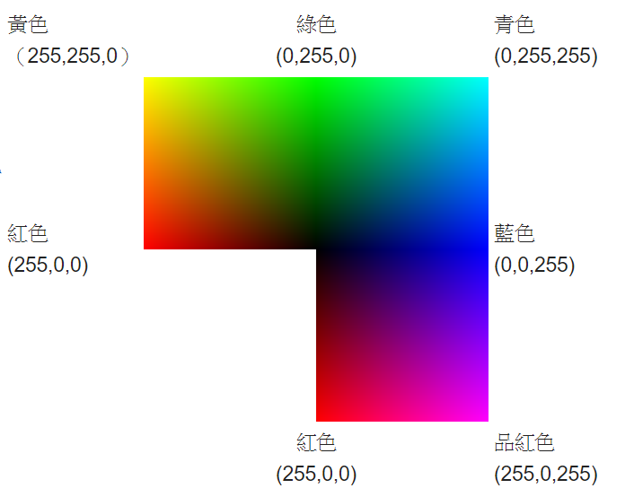
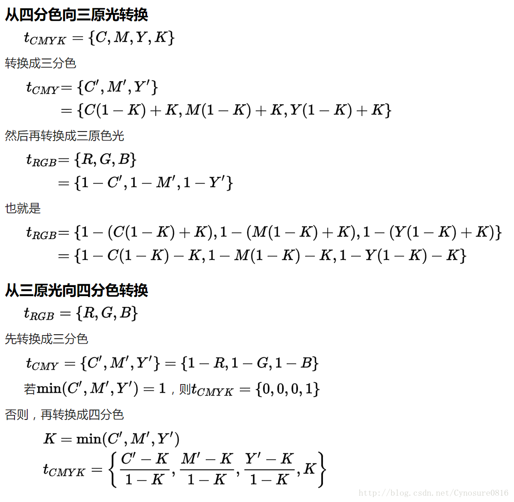

# 色彩表示与编码

顏色或色彩是通過眼、腦和我們的生活經驗所產生的一種對光的視覺效應。人對顏色的感覺不僅僅由光的物理性質所決定，還包含心理等許多因素，比如人類對顏色的感覺往往受到周圍顏色的影響。有時人們也將物質產生不同顏色的物理特性直接稱為顏色。

而在计算机中，我们通常有两种主要模式来表示色彩，分别是RGB模式和CMYK模式。

#  **一。 RGB 模式**
>三原色光模式（RGB color model），又稱RGB顏色模型或紅綠藍顏色模型，是一種加色模型，將紅（Red）、綠（Green）、藍（Blue）三原色的色光以不同的比例相加，以產生多種多樣的色光。(且三原色的紅綠藍不可能用其他單色光合成)

>光的三原色是紅色、綠色和藍色，三種光相加會成為白色光。

## **1.数值表示**
一個顏色顯示的描述是由三個數值控制的，他分別為R、G、B。但三個數值位為最大時，顯示為白色，當三個數值最小時，顯示為黑色。

數值表示可以使用以下幾種不同的方式:

* 從0到1之間可用的數來表示----浮點   
* 從0%到100%----百分比  
* 使用0到255之間的整數，八位數字表示，通常表示為十進位和十六進位的數值  
* 高階數位影像裝置通常會使用更大的整數來表示，比如0 . . 1023(10位),0 . . 65535(16位元)或更大 例如紅色在不同方式下的表示。

|  方式  | RGB表示 
|:---:|:-----:|:---------:|:---------:|
|  浮点 |    (1.0, 0.0, 0.0)|     
| 百分比  |  100%, 0%, 0%)   |   
| 八位数字  | (255, 0, 0) 或#FF0000 (十六進位)     |  
| 十六位数字  | 	(65535, 0, 0)     |
   
## **2.电脑显示模式**
24bit模式
每像素24位元（bits per pixel，bpp）編碼的RGB值：使用三個8位元無符號整數（0到255）表示紅色、綠色和藍色的強度。這是當前主流的標準表示方法，用於真彩色和JPEG或者TIFF等圖檔格式里的通用顏色交換。它可以產生一千六百萬種顏色組合，對人類的眼睛來說，其中有許多顏色已經是無法確切的分辨。

下圖展示了24 bpp的RGB立方體的三個「完全飽和」面，它們被展開到平面上： 

(0, 0, 0)是黑色  
(255, 255, 255)是白色 
(255, 0, 0)是紅色 
(0, 255, 0)是綠色 
(0, 0, 255)是藍色 
(255, 255, 0)是黃色 
(0, 255, 255)是青色 
(255, 0, 255)是品紅 

附上
[RGB颜色编码大全](http://www.qianduan8.com/520.html)
#  **二。 CMYK 模式**
>印刷四分色模式（CMYK）是彩色印刷時採用的一種套色模式，利用色料的三原色混色原理，加上黑色油墨，共計四種顏色混合疊加，形成所謂「全彩印刷」。四種標準顏色是：
>* C：Cyan ＝ 青色，常被誤稱為「天藍色」或「湛藍」 
>* M：Magenta ＝ 洋紅色，又稱為「品紅色」 
>* Y：Yellow ＝ 黃色 
>* K：blacK ＝ 黑色，雖然有文獻解釋說這裡的K應該是>Key Color（定位套版色）

## **1.显示**
印刷和電腦螢幕顯示，分屬兩種不同的色彩模式（電腦螢幕為發光體，遵循RGB「三原色光模式原理」；印刷為CMY+K油墨或墨水疊印、混色，遵循的是CMY「色料的三原色原理」），加上一般油墨印刷各原色網點色階為0～100%，而電腦螢幕各原色光色階為0～255，兩者產生的色彩數差距甚大：CMYK僅有101³+101共1,030,402色，而RGB卻有256³共16,777,216色；加上前述印刷油墨並非理想純色，實際形成。

## **2.转换**

