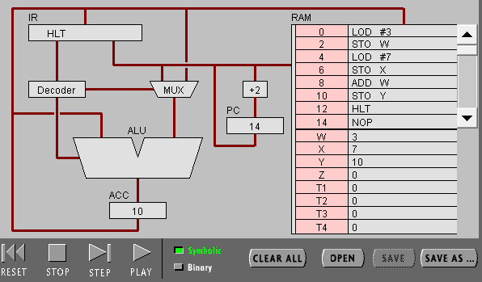
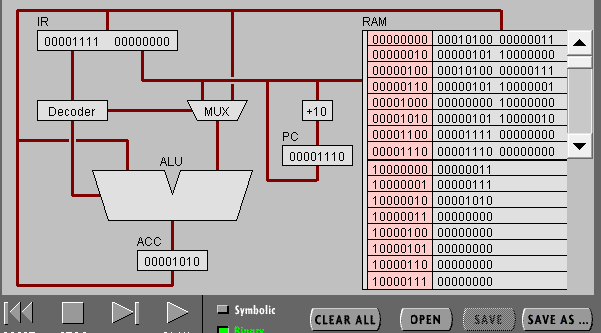
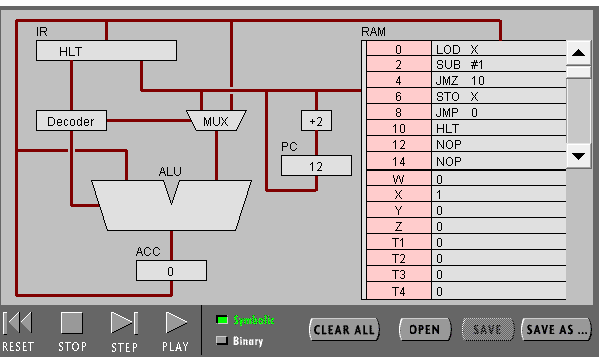
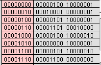

# 硬件编程–机器指令编程


1.PC，IR 寄存器的作用。<br>
PC:程序计数器是用于存放下一条指令所在单元的地址的地方。
<br>
IR:指令寄存器（IR，Instruction Register），是临时放置从内存里面取得的程序指令的寄存器，用于存放当前从主存储器读出的正在执行的一条指令。<br>

2.ACC 寄存器的全称与作用。<br>
ACC（Accumulator）是累加器A缩写。累加器A是一个具有特殊用途的二进制8位寄存器，专门用来存放操作数或运算结果。在CPU执行某种运算前，两个操作数中的一个通常应放在累加器A中，运算完成后累加器A中便可得到运算结果。<br>

3.用“LOD #3”指令的执行过程，解释Fetch-Execute周期。<br>
内存中获取指令，将指令寄存在IR寄存器，Decoder对指令进行解码，将LOD传给ALU，MUX将操作数传入ALU，ALU运算得到结果寄存ACC中,最后PC+2,准备读入下一条指令。<br>

4.用“ADD W” 指令的执行过程，解释Fetch-<br>
内存中获取指令，将指令寄存在IR寄存器，Decoder对指令进行解码，MUX将W中的和ACC中的值传入ALU，ALU执行ADD操作将两数相加，并将结果存入ACC中。最后PC+2,准备读入下一条指令。<br>

5.“LOD #3” 与 “ADD W” 指令的执行在Fetch-Execute周期级别，有什么不同。<br>
LOD #3只需访问RAM一次,而ADD W需要两次访问RAM。


1. 写出指令 “LOD #7” 的二进制形式，按指令结构，解释每部分的含义。<br>
00010100 000000111<br>
前面是命令指示，后面是操作数。

2. 解释 RAM 的地址。

3. 该机器CPU是几位的？（按累加器的位数）<br>
16位。

4. 写出该程序对应的 C语言表达。
```
   #include <stdio.h>
    main(){
        int W=3;
        int X=7;
        int Y=W+X;
    }
```


任务 2：简单循环

（1） 输入程序Program 2，运行并回答问题：

用一句话总结程序的功能
把X上的数值-1直到ACC为0。

写出对应的 c 语言程序
···

    #include <stdio.h>
    main(){
        int X=3;
        while (X != 0){
            X--;
        }
    }
（2） 修改该程序，用机器语言实现 10+9+8+..1 ，输出结果存放于内存 Y<br>
//////////////////////
1. 写出 c 语言的计算过程

```
    #include <stdio.h>
    main(){
        int X=11;
        int Y=0;
        while ( X != 0 ){
            X--;
            Y=Y+X;
        }
    }
```
2. 写出机器语言的计算过程<br>
<br>

3. 用自己的语言，简单总结高级语言与机器语言的区别与联系。<br>
区别：高级语言容易给使用者理解，而机器语言比较难理解。<br>
联系：高级语言都要转化成机器语言才被计算机运行。
