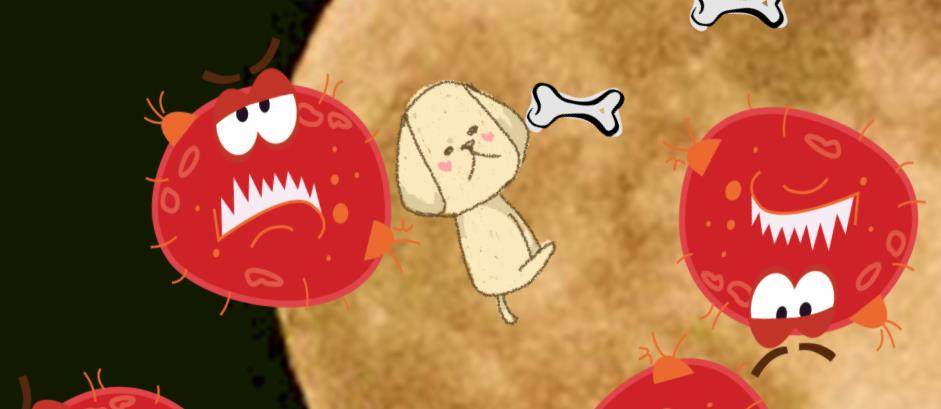
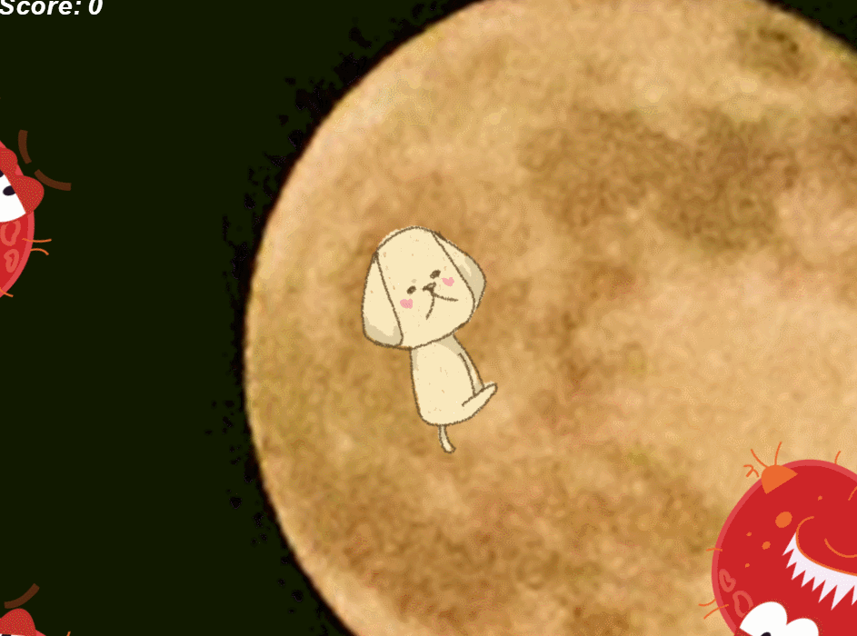

# Construct HTML小游戏2策划篇

## **1. 游戏概念：**
面向各个年龄层制作的简单射击游戏。

## **2. 游戏背景：**
在某个月圆的日子中，地球上的红色怪兽都蜂拥而上=出，进攻了整个地球，作为世界上的最后一只英雄物种大英雄B仔，请用你的骨头拯救地球吧！

## **3. 游戏玩法：**
`键盘`上下左右移动主角配合`鼠标`随意点击画面发出骨头攻击怪兽。

## **4. 游戏设定和道具：**
`Player`：B仔(hero)，可以使用键盘移动人物。点击人物可以发射骨头来攻击怪兽。如果人物碰到怪兽游戏便立即结束。 
`monster`：红色怪兽(monster)，移动速度跟人物移速一样。要攻击多次才会死亡。 
`hotdog`：骨头(bone)，可以从Player嘴中发射出来，可用于攻击怪兽。 
`score`：击杀一个怪物加80分。

## **5. 游戏设计：**

|步骤 |1|2|3|4|5|6|7|
|:---:|:---:|:---:|:---:|:---:|:---:|:---:|:---:|
|Object|bone|hero|monster|background|explosion|game overtext|score
|Atribute|图片,位置|图片,位置，动作，移动|图片,位置，移动（速度方向）|图片|图片|文本|文本
|Collaborator|hero，monster |bone,monster|hero,bone|/|bone,monster|hero,monster|monster
|Events&Actions|碰撞 & 销毁自己|旋转&移动&设计&&接触怪兽死亡|自由移动&自动生成接触三个bone销毁&碰到hero游戏结束|/|透明淡化效果,攻击怪兽使怪兽死亡|开始隐藏&hero碰上monster时出现|monster消失时数值增加

## **6. 成果显示：**

## **7.小结：**