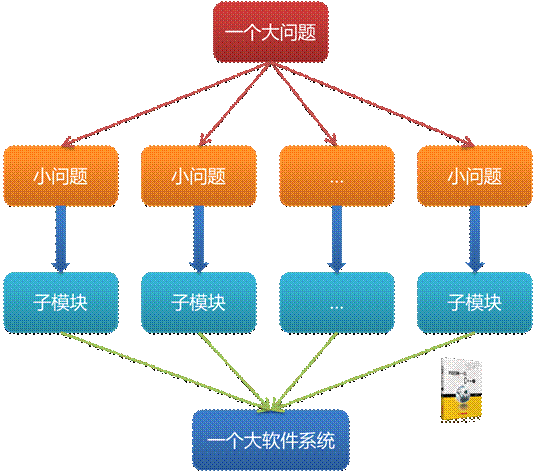

# **“自顶向下，逐步求精”洗衣机程序设计**
## 什么是自顶向下，逐步求精?
>指的是程序设计时，应先考虑总体，后考虑细节；先考虑全局目标，后考虑局部目标。不要一开始就过多追求众多的细节，先从最上层总目标开始设计，逐步使问题具体化。对复杂问题，应设计一些子目标作为过渡，逐步细化。

>简单地指，自顶向下就是由大问题划分成小问题，逐步求精就是将抽象转化成逻辑空间和实际。
 

## 洗衣机案例
>而具有“自顶向下，逐步求精”的最典型例子就是洗衣机的运作过程，那么现在就来看看洗衣机是如何运作的吧。

s

首先我们要思考洗衣机运作步骤：
1. 输入洗衣参数（洗衣模式）：水位要求与洗衣时间
2. 打开上水开关，返回水的高度，当 `当前水位=水位要求`，关闭开关
3. 浸泡
4. 电机转动，左右各三圈，返回时间计数，`当时间计数=洗衣时间`，停止转动
5. 打开排水开关，返回水的高度，当`当前水位=零`，关闭开关
6. 停机

理清基本过程之后就可以打出伪代码： 

    scanf(水位，洗衣模式) 
    while(当前水位<指定水位) 
    加水； 
    while(运行时间<指定洗衣模式时间) 
    洗衣机来回转动； 
    while(水位=0) 
    进入脱水模式； 
    while(脱水时间=指定时间) 
    retrun;