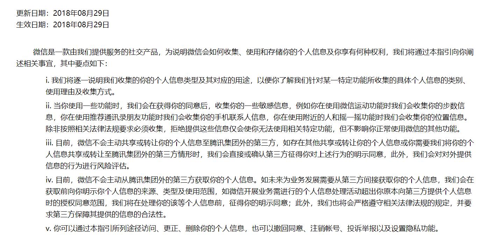

# IT 伦理与道德
>引言：互联网的发展迅速，导致网上很常出现一些涉及到法律界限的言论或者的行为。网络之大我们无法透过正常程序去控制我们使用IT的安全。那么，就让我们来看看我们很常使用之一的微信平台到底有什么相关的事实吧。

## **一、微信到底有没有偷看我们的聊天记录**
2018年1月1日，正和岛新年论坛上吉利董事长李书福关于“现在的人几乎是全透明的， 没有任何隐私和信息安全”的一席话，“马化腾肯定天天在看我们的微信，因为他都可以看，随便看”，引发了一阵讨论。
然而，很快，1月2日公众号微信派推文《用了这么久微信，这件事你还是不知道》称：

1. **微信不留存任何用户的聊天记录，聊天内容只存储在用户的手机、电脑等终端设备上；**
2. **微信不会将用户的任何聊天内容用于大数据分析；**
3. **因微信不存储、不分析用户聊天内容的技术模式，传言中所说“我们天天在看你的微信”纯属误解。**

详情请看[微信隐私保护指引](https://weixin.qq.com/cgi-bin/readtemplate?lang=zh_CN&t=weixin_agreement&s=privacy)

## **二、大学生微信网络社交伦理失范的表现。**
大学生微信网络社交伦理失范主要表现在四个方面，分别为诚信缺失、传播虚假信息、侵犯他人隐私和不尊重他人。以下午为相关案例。

>某女生小丽是一名在校女大学生，在日常的生活中，她特别喜欢上网，她也很喜欢与在微信上聊天，2012 年 12 月，在微信上碰到了"添加好友"的请求，这名男网友自称做生意，家底殷实，交往一段时间后，某次他将小丽带到宾馆，后因小丽发现其姓氏出入，查看其身份证，该男子趁当事人不备，偷走了当事人的钱物，当事人慌忙报警，最后证实该男子身份系伪造。

>2013 年 8 月某在校女大学生小张，编写《致二个年轻的生命，略阳的孩子转起》一文，该女生在不了解事情完整经过的情况下，通过微信等媒体传播其自行编写的文章，网友们不经考证大量转发，一时间，公安机关在事后不搜救、警察搜救计费 4000-5000元的谣言四起，严重损害了公安机关的形象，后来念于其学生的身份，最后公安机关决定对其处于 200 元的行政处罚。

>同学，22 岁，大三学生，使用微信 3 年王同学来自南京市，目前就读于南京的一所高校，自微信推出时起，就下载安装了这款手机APP,王同学使用微信的时间比较早，王同学说：“他发在朋友圈内的一些文字会被朋友转发，因为是比较熟的朋友，所以也不好讲什么，但是他没有经过我的同意就转发了我的信息，这让王同学觉得不舒服，朋友如果未经过我的同意将我的信息发送到微博或者网上，我会觉得他侵犯了我的隐私权。”

## 三、**微信二维码支付的风险由谁买单**

* 微信二维码“付款”支付最重要的特色就是，在一定额度及次数内免除密码、短信动态码以及任何信息验证。这是一个不安全的支付模式，却又要在实践中广为应用。那么，出路只能是解决好风险防范问题或者风险发生后的责任分担问题，这样才能把一个不安全的支付模式转变成一个实质上安全的支付模式。

* 根据微信支付“付款”用户协议的表述，非授权交易产生的所有损失都由用户本人承担。“付款”支付模式也没有足够安全的防护措施来防止非授权交易风险的发生。微信支付在推动市场发展、提高市场交易效率方面的功劳自然不容忽视，但是让消费者陷入危险也不得不令人重视。

* 微信支付既然要推行与国际接轨的无密码支付方式，也自然应该推行与国际接轨的非授权交易责任承担机制——消费者在非授权交易中只承担有限责任的制度。对于微信支付，这并非强其所难。