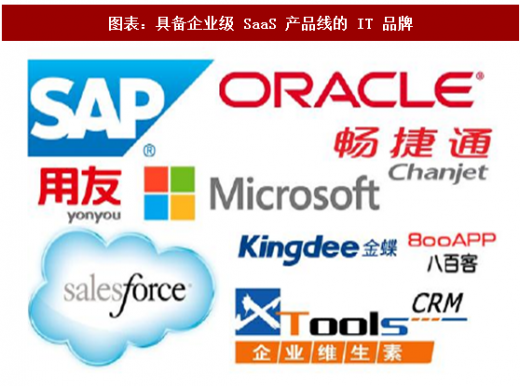

# **IT风投知多少**
`引言：互联网以及科技的进步，让全球能迅速发展起来。而当中不免会跟经济发展扯上关系，而当一个公司发展起来便会引起其他的注意或者进行了投资那么，IT界的风投又是什么呢`

首先我们理解一下什么叫是做**风投**。
>**风投(Venture Capital)亦指风险投资**是一种私募股权，一种融资形式，由公司或基金提供给被认为具有高增长潜力或已经表现出高增长的小型早期新兴公司（员工数量，年收入或两者兼而有之）。

风险投资内在的推动力就是科技的不断发展进步。由于新的行业会不断取代老的行业在世界经济中的地位，专门投资新兴行业和技术的风险投资从长期来讲回报必定高于股市。因此风险投资看上去风险大，但是并不是赌博，它和私募基金都是至今为止收益最高的投资方式。

而IT行业在日新月异的科技进步之下，当中的风投价值就越来越高。而期中有一篇报告提及了2018年中国IT的发展方向。一下为几个方向的发展趋势。

### **1. SaaS**
企业级 SaaS 作为互联网产品的一种，直接受益于互联网和移动互联网的兴起。企业级 SaaS 的兴起创造了大量互联网产品职位需求，成为了 IT 专业毕业生的主要就业方向之一。

### **2. 网络游戏**
互联网和移动互联网的普及也使得网络游戏行业进入了高速发展时期，据智研咨询的统计和预测：2007 年我国网络游戏市场规模仅为 128 亿元，2017 年市场规模已突破 2000 亿元，实现了 10 倍增长。从端游到页游再到手游，网络游戏的用户群体不断扩大。正是因为游戏行业存在巨大的专业人才需求，翡翠教育等专业培训机构聚焦游戏行业专业人才培训，实现了机构规模的快速扩张。

### **3. 在线视频**
 各类特效软件和三维技术软件的更新换代带动了影视娱乐行业的发展，带来了网络视频行业规模持续增长及电影票房的复苏，也带来了影视制作高级人才的供不应求。与此同时，我国影视制作人员水平已受到国际认可。

### **4. 动漫行业**
动漫行业显著受益于 IT 技术的进步和互联网的普及，制作水平日臻完善，传播渠道不断丰富，产业规模由 2013 年的 876 亿元提升至 2017 年的 1500 亿元，预计 2020 年将达到 2100 亿元。

### **5. VR/AR** 
2016 年作为 VR/AR 产业兴起的元年，吸引了 IT 行业最多的关注，据 IDC 预测，2020 年 VR/AR 产业规模将达到 1070 亿美元，产业规模将大于动漫、游戏、影视。国际巨头索尼、微软、Facebook 等 IT 巨头纷纷布局 VR 硬件，国内的 33 家 VR/AR 企业半年内完成 12 亿元人民币的融资。

### **6. 人工智能**
人工智能（AI）也是目前 IT 行业关注的前沿技术，我国政府于 2017 年发布了《新一代人工智能发展规划》，确定了人工智能的战略地位，预计 2020 年我国人工智能行业规模将达到约 700 亿人民币。百度、阿里、腾讯、科大讯飞成为第一批入选国家 AI 开放创新平台的企业，更是印证了未来几年我国最尖锐的 IT 力量将投入人工智能研发的趋势。

详见：[2018年中国IT行业前沿领域市场规模及人才需求分析（图表）](http://free.chinabaogao.com/it/201803/0353230292018.html)

上述的这几个方向对于投资者来说是一个很有价值的参考。企业依照现时阶段以及未来发展趋势去选择投资对象。IT在现时的社会中无愧是最有发展空间的行业。投资者也该去查找更多的资料去了解IT界存在的风险投资。