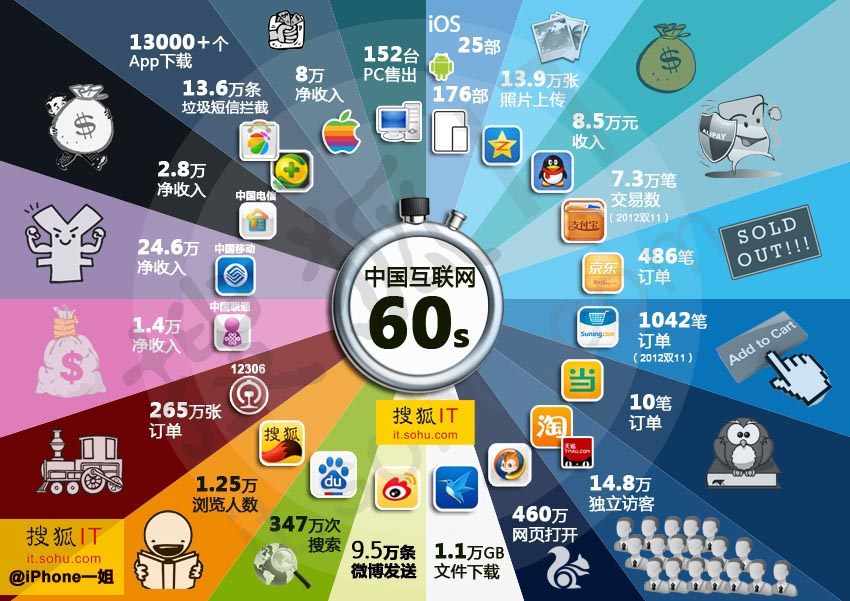
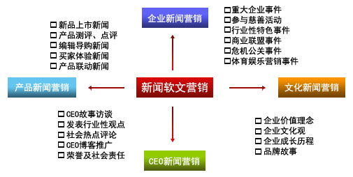

# 互联网时代的热点领域选择、营销方法
## **一、热点领域选择**
>这里介绍的热点领域是指对于未来互联网发展的几个"吃香“的发展方向领域。

1. **IPv6**：IPv6是Internet Protocol Version 6的缩写，其中Internet Protocol译为“互联网协议”。IPv6是IETF（互联网工程任务组，Internet Engineering Task Force）设计的用于替代IPv4的下一代IP协议，号称可以为全世界的每一粒沙子编上一个网址 。
由于IPv4最大的问题在于网络地址资源有限，严重制约了互联网的应用和发展。IPv6的使用，不仅能解决网络地址资源数量的问题，而且也解决了多种接入设备连入互联网的障碍。

2. **python**：Python是一种计算机程序设计语言。是一种动态的、面向对象的脚本语言，最初被设计用于编写自动化脚本(shell)，随着版本的不断更新和语言新功能的添加，越来越多被用于独立的、大型项目的开发。

3. **大数据**：大数据（big data），指无法在一定时间范围内用常规软件工具进行捕捉、管理和处理的数据集合，是需要新处理模式才能具有更强的决策力、洞察发现力和流程优化能力的海量、高增长率和多样化的信息资产。

4. **自媒体传统媒体**:是指私人化、平民化、普泛化、自主化的传播者，以现代化、电子化的手段，向不特定的大多数或者特定的单个人传递规范性及非规范性信息的新媒体的总称。自媒体平台包括：博客、微博、微信、百度官方贴吧、论坛/BBS等网络社区。

5. **人工智能**：人工智能（Artificial Intelligence），英文缩写为AI。它是研究、开发用于模拟、延伸和扩展人的智能的理论、方法、技术及应用系统的一门新的技术科学。

6. **区块链**：块链是分布式数据存储、点对点传输、共识机制、加密算法等计算机技术的新型应用模式。 [1] 

7. **物联网**：物联网是新一代信息技术的重要组成部分，也是“信息化”时代的重要发展阶段。其英文名称是：“Internet of things（IoT）”。顾名思义，物联网就是物物相连的互联网。这有两层意思：其一，物联网的核心和基础仍然是互联网，是在互联网基础上的延伸和扩展的网络；其二，其用户端延伸和扩展到了任何物品与物品之间，进行信息交换和通信。

## **二、网络营销**

>互联网营销也称为网络营销，就是以国际互联网络为基础，利用数字化的信息和网络媒体的交互性来实现营销目标的一种新型的市场营销方式。以下为常见的网络营销手法。

### **1、搜索引擎营销**
**搜索引擎营销**（Search Engine Marketing，缩写为SEM）是一种以透过增加搜索引擎结果页能见度的方式，或是透过搜索引擎的内容联播网来推销网站的网络营销模式。实现搜索引擎的主要方式有:**登录搜索引擎**、**搜索引擎优化和竞价**以及**关键词广告**。

## **2、即时通讯营销**
**IM营销**又叫**即时通讯营销**是企业通过即时工具IM（Instant messaging）帮助企业推广产品和品牌的一种手段，常用的主要有一种两种情况：
 
　　第一种，网络在线交流，中小企业建立了网店或者企业网站时一般会有即时通讯在线，这样潜在的客户如果对产品或者服务感兴趣自然会主动和在线的商家联系。
 
　　第二种，广告，中小企业可以通过IM营销通讯工具，发布一些产品信息、促销信息，或者可以通过图片发布一些网友喜闻乐见的表情，同时加上企业要宣传的标志。

## **3、病毒式营销**
**病毒式营销**(viral marketing,也可称为病毒性营销)是一种常用的网络营销方法，常用于进行网站推广、品牌推广等，病毒式营销利用的是用户口碑传播的原理，在互联网上，这种“口碑传播”更为方便，可以像病毒一样迅速蔓延，因此病毒式营销（病毒性营销）成为一种高效的信息传播方式，而且，由于这种传播是用户之间自发进行的，因此几乎是不需要费用的网络营销手段。

## **4、bbs论坛营销**
**BBS营销**就是“利用论坛这种网络交流的平台，通过文字、图片、视频等方式发布企业的产品和服务的信息，从而让目标客户更加深刻地了解企业的产品和服务。最终达到宣传企业的品牌、加深市场认知度的网络营销活动”，就是BBS营销。

## **5、微博营销**
**微博营销**是指通过微博平台为商家、个人等创造价值而执行的一种营销方式，也是指商家或个人通过微博平台发现并满足用户的各类需求的商业行为方式。微博营销以微博作为营销平台，每一个听众（粉丝）都是潜在的营销对象，企业利用更新自己的微型博客向网友传播企业信息、产品信息，树立良好的企业形象和产品形象。

## **6、微信营销**
**微信营销**是网络经济时代企业或个人营销模式的一种。是伴随着微信的火热而兴起的一种网络营销方式。微信不存在距离的限制，用户注册微信后，可与周围同样注册的“朋友”形成一种联系，用户订阅自己所需的信息，商家通过提供用户需要的信息，推广自己的产品，从而实现点对点的营销。

## **7、视频营销**
**视频营销**是指主要基于视频网站为核心的网络平台，以内容为核心、创意为导向，利用精细策划的视频内容实现产品营销与品牌传播的目的；是“视频”和“互联网”结合，具备二者的优点；具有电视短片的优点如感染力强、形式内容多样、创意新颖等，又有互联网营销的优势如互动性、主动传播性、传播速度快、成本低廉等；

## **8、软文营销**
**软文营销**，就是指通过特定的概念诉求、以摆事实讲道理的方式使消费者走进企业设定的"思维圈"，以强有力的针对性心理攻击迅速实现产品销售的文字模式和口头传播。 比如：新闻，第三方评论，访谈，采访，口碑。

## **9、020立体营销**
**O2O立体营销**，是一种基于O2O（线上连接线下）的全媒体深度整合的营销模式，其运用信息系统移动化，并结合大数据分析，帮助品牌企业打造全方位营销渠道，实现全面以营销效果为导向的立体营销网络。

## **10、新媒体营销**
**新媒体营销**是指利用新媒体平台进行营销的方式。在web2.0带来巨大革新的年时代，营销方式也带来变革，沟通性（communicate）、差异性（variation）、创造性（creativity）、关联性（relation），体验性（experience）、互联网已经进入新媒体传播时代。

## **小结**
因为互联网，让商家在网上宣传以及进行交易活动更加方便以及广泛，而作为用户的我们在此类型的活动也相对地更加方便。而网络平台上也相对出现五花八门的营销方法以及手段，其中肯定会有优处也会有坏处，我们要懂得善用互联网进行一切的活动。
